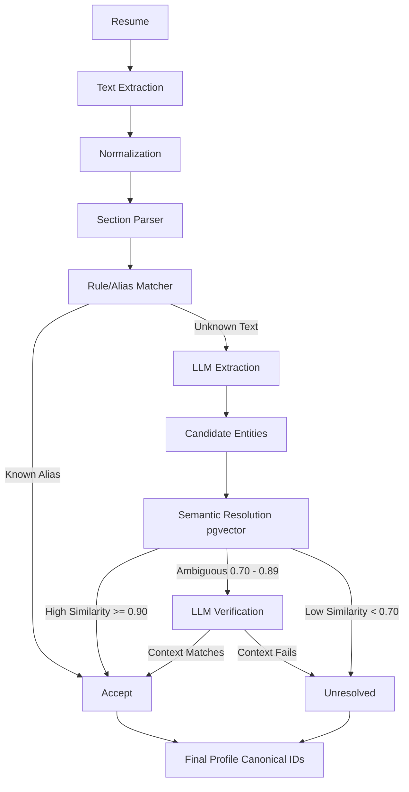

# Hybrid Resume Parser Architecture

```mermaid
flowchart TD
    A[Resume] --> B[Text Extraction]
    B --> C[Normalization]
    C --> D[Section Parser]
    D --> E[Rule/Alias Matcher]
    
    E -- Known Alias --> ACCEPT[Accept]
    E -- Unknown Text --> F[LLM Extraction]
    
    F --> G[Candidate Entities]
    G --> H[Semantic Resolution pgvector]
    
    H -- High Similarity >= 0.90 --> ACCEPT
    H -- Ambiguous 0.70 - 0.89 --> I[LLM Verification]
    H -- Low Similarity < 0.70 --> REJECT[Unresolved]
    
    I -- Context Matches --> ACCEPT
    I -- Context Fails --> REJECT
    
    ACCEPT --> J[Final Profile Canonical IDs]
    REJECT --> J
```
